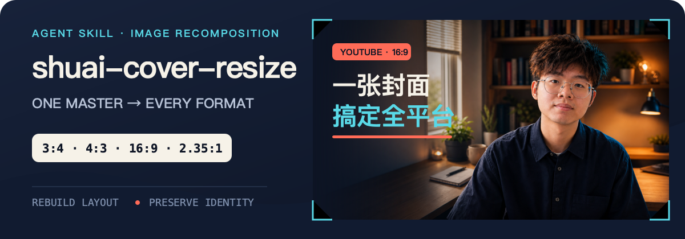
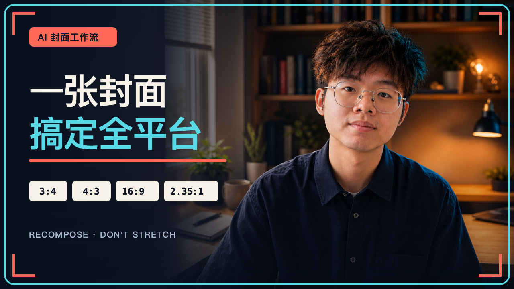

<p align="right">
  <a href="./README.md">简体中文</a> · <strong>English</strong>
</p>

<p align="center">
  
</p>

<h1 align="center">shuai-cover-resize</h1>

<p align="center">
  Recompose one master cover for Xiaohongshu, Bilibili, YouTube, WeChat Channels, and WeChat articles.<br>
  No stretching or blind cropping—rebuild the layout while preserving copy, identity, and brand style.
</p>

<p align="center">
  <br>
  <sub>Conceptual 16:9 YouTube example: ImageGen reconstructs the person and background; SVG keeps copy and layout exact.</sub>
</p>

## Quick start

Install with the [Agent Skills CLI](https://skills.sh/docs/cli):

```bash
npx skills add qizong007/shuai-cover-resize
```

The CLI will ask you to select the target agent and installation scope. Then attach the source cover and invoke:

```text
Use $shuai-cover-resize to adapt this cover to 3:4, 4:3, and 16:9.
Keep the title, subject identity, and brand colors unchanged.
```

To update later:

```bash
npx skills update shuai-cover-resize
```

## What it solves

The hard part of publishing one cover across platforms is not the pixel dimensions—it is the information hierarchy. A landscape title can crowd a portrait subject, a larger face can cover the copy, and a narrow background is often stretched instead of reconstructed.

`shuai-cover-resize` treats the source image as the single master and rebuilds every ratio independently:

- Preserve the exact title, topic, subject identity, key objects, and brand recognition.
- Allow background extension, element movement, reframing, subject scaling, and text reflow.
- Never stretch non-uniformly or derive a new format from an intermediate result.
- Validate every result independently and retry failed ratios only.

## Supported platforms

| Ratio | Platform | Composition priority | Minimum resolution |
| --- | --- | --- | ---: |
| `3:4` | Xiaohongshu | Dense portrait layout with mobile-readable subject and title | 1080×1440 |
| `4:3` | Bilibili | Balanced landscape hierarchy between subject and title | 1200×900 |
| `3:4` / `4:3` | WeChat Channels | Portrait and landscape formats with a clear subject and title in feed previews | 1080×1440 / 1200×900 |
| `16:9` | YouTube | Strong landscape focus with subject and title separated | 1280×720 |
| `2.35:1` | WeChat article | Editorial ultra-wide layout with more negative space | 900×383 |

When no ratio is specified, the skill defaults to `4:3`, `3:4`, and `16:9`; both `4:3` and `3:4` work for WeChat Channels. The `2.35:1` version is added only when a WeChat article or ultra-wide cover is explicitly requested.

## Recommended: ChatGPT with ImageGen

> This skill works best with an agent that can use **ChatGPT ImageGen for source-image editing**.

The repository provides a reconstruction and validation workflow; it does not include an image model. The runtime must be able to pass the actual source cover to an image-editing model instead of recreating it from a text description alone.

Other source-image editing models may work, but the current workflow is designed primarily around ImageGen. Identity consistency, Chinese typography, and outpainting quality can vary significantly between models.

## Workflow

```text
Read source → lock copy and identity → detect matching ratios
            → rebuild every target independently from the master
            → inspect dimensions, copy, people, composition, and quality
            → retry failed variants only → deliver with stable names
```

The included [`detect_ratio.py`](./scripts/detect_ratio.py) uses only the Python standard library and supports PNG, JPEG, and GIF:

```bash
python3 scripts/detect_ratio.py cover.png 4:3 3:4 16:9
```

It reports which ratios can reuse the source and which require generation.

## Limitations

- **Text requires human review.** Generative models are not reliable typesetting engines. If copy remains unstable, generate a clean background and add the exact text with a professional layout tool.
- **Pixel-perfect reproduction is not guaranteed.** Faces, hands, fonts, logos, and small details may drift. Provide original logos, fonts, or editable design files when exact brand fidelity matters.
- **Source quality sets the ceiling.** Blurred, low-resolution, heavily occluded, or unreadable details cannot be restored reliably. Unreadable copy must not be guessed.
- **Correct dimensions do not mean acceptance.** Review subject count, anatomy, copy, logos, watermarks, safe areas, and platform UI overlap for every output.
- **Use authorized material only.** Assess copyright and privacy risks before uploading portraits, brand assets, or confidential artwork.

## Output convention

Generated files are placed beside the source image:

```text
<source-name>__3x4
<source-name>__4x3
<source-name>__16x9
<source-name>__235x100
```

Existing files are never overwritten; a numeric suffix is appended instead. If the source already matches a requested ratio and no extra edit is needed, the original image is reused.

## Repository structure

```text
shuai-cover-resize/
├── SKILL.md                 # Workflow and acceptance criteria
├── README.md                # Chinese documentation (default)
├── README.en.md             # English documentation
├── agents/openai.yaml       # Skill interface metadata
├── scripts/detect_ratio.py  # Aspect-ratio detector
└── assets/readme/           # README visuals and editable source files
```

## Maintenance and contributions

This Agent Skill is intended for long-term maintenance:

- Treat `SKILL.md` as the single source of truth for behavior, defaults, and acceptance criteria.
- Update both language versions when platform specifications or minimum resolutions change.
- Test PNG, JPEG, and GIF dimension detection after modifying the script.
- Avoid changes that rewrite source copy, stretch artwork, weaken identity consistency, or skip validation.
- When filing an issue, include source dimensions, target ratios, runtime environment, and the exact failure. Do not upload private source material publicly.

The README hero combines a project-specific ImageGen subject with deterministic SVG typography and ratio frames. The final prompt and editable layout live under [`assets/readme/source/`](./assets/readme/source/).
